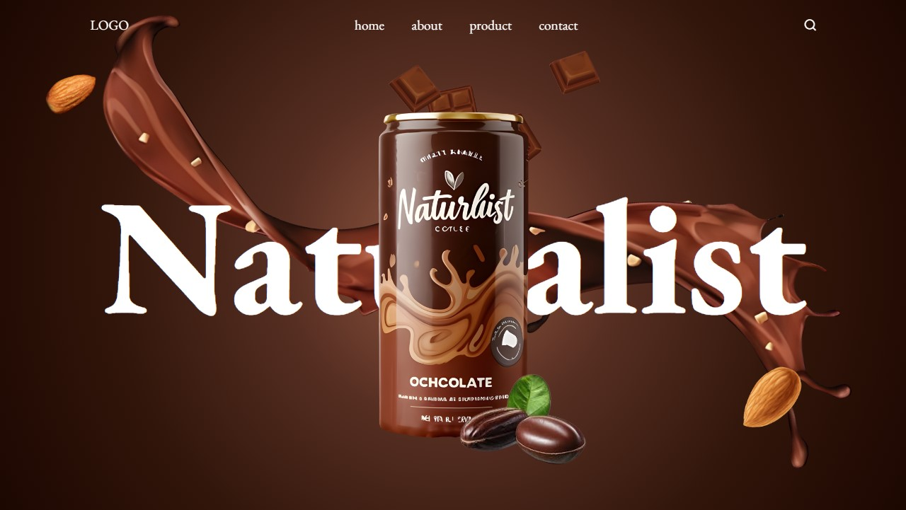

# Naturalist - Animated Product Showcase

Naturalist is a clean and simple animated product showcase website built using **HTML**, **CSS**, **JavaScript**, and **GSAP (GreenSock Animation Platform)**. This project demonstrates smooth animations and an engaging user experience to display products in a visually appealing way.

## Screenshot


## Features
- **Clean Design**: A minimalistic and visually pleasing layout to focus attention on the products.
- **Smooth Animations**: Product transitions and animations using GSAP for an engaging experience.
- **Custom Animations**: Animations are handled using GSAP for enhanced flexibility and performance.

## Tech Stack
- **HTML5**: For the structure of the web page.
- **CSS3**: For styling and layout design.
- **JavaScript (ES6+)**: For interactivity and functionality.
- **GSAP (GreenSock Animation Platform)**: For advanced animations and transitions.

## How to Run the Project
1. Clone the repository:
   ```bash
   git clone https://github.com/vedantraval3011/naturalist.git
   ```
2. Navigate to the project directory:
   ```bash
   cd naturalist
   ```
3. Open the `index.html` file in your browser to view the animated product showcase.

## How It Works
Naturalist leverages **GSAP** for smooth animations, creating a dynamic and interactive product showcase. By combining GSAP with simple HTML, CSS, and JavaScript, the site provides a seamless, polished experience.
- The animations are triggered on scroll and hover events, making the website more interactive.
- The layout adjusts to different screen sizes, ensuring a responsive design.

## Customization
You can customize the following parts of the project:
- **Product Images**: Replace the current images in the `images` folder with your own products.
- **Animations**: Modify the GSAP animations by adjusting the duration, easing, and timing in the JavaScript code.
- **Styles**: Change the appearance of the website by modifying the CSS in `styles.css`.

## Demo
You can view a live demo of the project [here](https://your-live-demo-link.com).

## Contributing
Feel free to submit a pull request if you want to contribute to this project. Any contributions, such as adding new features, fixing bugs, or improving documentation, are welcome.

## License
This project is licensed under the MIT License - see the [LICENSE](LICENSE) file for details.

---
Feel free to fork this repository, modify it as needed, and use it for your own projects. If you find it useful, consider giving the repository a star!
